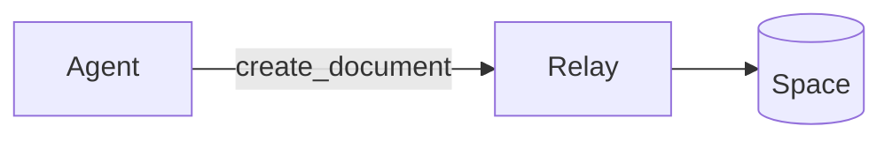

# kutl-flavored markdown (KFM)

kutl documents are markdown. The base is GFM (GitHub-Flavored Markdown);
everything an agent or editor expects from GFM works unchanged. KFM adds a
small set of in-doc extensions tuned for collaboration: cross-document
links, comment anchors, mentions, decision markers, callout blocks, and
rich embedded media.

This document is the canonical reference for the dialect. It ships with
every kutl install via `include_str!` into both the `kutl` binary
(`kutl init` writes it into the managed section of repo-root `AGENTS.md`)
and the relay binary (concatenated into the MCP
`InitializeResult.instructions` string). Same content, two delivery
vehicles.

## Cheat sheet

| Syntax | What it is |
|---|---|
| `[label](sibling.md)`, `[label](sub/other.md)` | Internal link to another doc in the same space — relative markdown path, NOT a wikilink |
| `[span text]{.cmt #signal-uuid}` | Comment anchor — paired with a `FLAG_KIND_COMMENT` signal whose UUID matches |
| `@did:kutlhub:account:N` or `@display-name` | Mention — load-bearing for notification audience targeting |
| `## ? Open question` / `## = Settled answer` headings | Decision marker — a first-class tracked signal; deeper levels nest sub-decisions |
| ` ```mermaid ` fenced block | Mermaid diagram (rendered inline in hybrid preview) |
| `$inline$` and `$$block$$` | KaTeX math |
| Paste image into editor | Auto-uploads + inserts `` |
| `> [!info] body` / `> [!warning] body` callout (flat, non-hierarchical) | Callout block — styled asides and attention flags; rendering only, never a tracked signal |

## Per-extension detail

### Internal links — standard markdown, relative paths

Cross-document links inside a space are **standard markdown links with
relative paths**. The link target is a path relative to the current
document, resolved against the space's document tree.

```markdown
See the [onboarding guide](onboarding.md) for orientation.
See [handbook/policies](../handbook/policies.md) for the full text.
[Project status](../projects/q2.md) updated weekly.
```

KFM does **not** use wikilink (`[[name]]`) syntax — see "Anti-syntax"
below. Relative paths resolve via the same rules as relative URLs:
no leading slash, `..` ascends one directory, `.` is the current
directory, intermediate directories are implicit.

When the link target does not resolve to an existing document, the
editor renders the link with a "not found" affordance; double-clicking
or Cmd-clicking can offer to create the document at that path.

Resolution runs server-side via the `ResolveDocumentPath` RPC:
matching is case-insensitive, percent-encoded characters are decoded
before matching, fragment identifiers (`#section`) are stripped, and
normalization clamps at the space root — `..` never escapes above it.

### Comment marker — `[text]{.cmt #signal-uuid}`

Comments anchor to a specific span of text in a document. The
in-doc form is a Pandoc-style bracketed span with a `.cmt` class
and an `#signal-uuid` identifier:

```markdown
The migration cap is bounded at three sources [exactly: Notion, docx,
gdocs]{.cmt #2c6e5b71-9a2c-4d4d-b1e1-7d8b1f3c5a2e}.
```

The UUID in the marker matches a `FLAG_KIND_COMMENT` signal stored in
the relay. The signal carries the comment body, author, and lifecycle
state (open/resolved); the marker carries position within the document.

To author a comment, the agent's flow is:

1. Mint a UUID client-side.
2. `read_document` the target and keep the `version` it returns.
3. Inject the `[text]{.cmt #signal-uuid}` marker into the document body at
   the position being commented on, via `edit_document` with that `version`
   as its `base_version`. The argument is required; an edit without it is
   rejected. The relay diffs the content against the text that version names
   and applies only what changed, so a marker injected from a slightly stale
   read does not revert whatever else landed meanwhile.
4. Emit a `create_flag(kind: 'comment', signal_id: <same-uuid>,
   anchor_text: <span text>, body: <comment text>, ...)` with the same
   UUID.

The relay's `handle_signal` honors caller-supplied signal UUIDs
(load-bearing for marker↔signal binding). The marker and the signal
bind by UUID equality — there is no separate join.

Renders as: an inline highlight + popover with the comment body in
the kutlhub web app; literal `[text]{.cmt #uuid}` in plain editors.

### Mentions — `@`-typing creates a targeted flag

"Mention" in kutl is editor-UX terminology, not a distinct entity.
Typing `@` in the editor pops a picker; selecting a person inserts an
inline marker that the relay materializes into a normal flag signal
with `kind` + `target_did`. The wire and storage form is *the same
flag* an explicit MCP `create_flag(kind, target_did)` RPC would
produce — there is no separate "mention" object on the wire, in the
database, or in the signal store. Use whichever surface is
convenient; both produce the same flag, and whoever is named
retrieves it the same way.

The marker form in the doc body is `@[Name](kind:account-id)` with
an optional `|<message>` portion carrying the picker-typed body:

```markdown
@[Jane](review_requested:acc-12345) please look at the proposal
@[Bob](info:acc-67890|FYI on the bandwidth bump)
@[Carol](question:acc-cafe|please add the list of mcp tools)
```

The optional `|<message>` portion is the picker-typed body —
equivalent to the `message` argument an MCP `create_flag` call
would carry. When present, it lands in `flag_details.message`.
When absent, the resulting signal's message defaults to
`@DisplayName`. The `account-id` ends at the pipe (`|`) or the
closing paren, whichever comes first.

The relay's marker observer parses each marker on every diff
(including the optional `|message` tail) and emits the materialized
flag — same shape, same kinds (`info`, `completed`,
`review_requested`, `question`, `blocked`), same audience
(`target_did = account id`). Removing the marker auto-closes the
resulting flag with `close_reason: withdrawn`.

**Picking your surface:**

- *Editor user typing `@`*: the editor inserts the marker; you don't
  hand-write the syntax.
- *MCP agent wanting to "@-mention" a person*: call
  `create_flag(kind, target_did, audience: 'participant')`. Don't
  inject the inline marker from MCP — the editor owns that path.
- *Targeting everyone in a space*: use `audience: 'space'`. There
  is no "@channel" syntax (see "Anti-syntax" below).

Renders as: an avatar + name pill in the kutlhub web app; literal
`@[Name](kind:id)` text in plain editors. Whichever surface created
it, the resulting flag is retrievable by the person named: an
MCP-connected agent finds it with `get_changes` and must ask to see
it. Whether a *human* is additionally notified, and by what route,
depends on the client that deployment gives them and on their own
preferences.

### Decisions — `## ?` and `## =` headings

Decisions are first-class signals, tracked from heading markers:

- `## ? Open question` — an unresolved question that needs a decision
- `## = Settled answer` — a resolved decision

Sub-decisions use deeper heading levels (e.g. `### ?` under a `## ?`
parent).

Resolve an open question by EDITING its heading's `?` to `=` in place —
do not add a second heading for the answer. Keep the heading title as
it is and put the answer in the body under it; rewriting the title
while resolving can sever the decision from its history.
Resolving the signal itself (`kutl signal resolve`, or a resolve tool
where one is available) does the flip for you, safely.

Deleting a `## ?` heading withdraws its decision — the question reads
as removed, not answered. When restructuring a document, move these
headings intact rather than rewriting through them.

Renders as: a decision-row pill in feed/board surfaces and an inline
decoration on the heading in the kutlhub web app; literal markdown in
plain editors.

### Callout blocks — unified syntax

Callouts use GFM-style alert syntax (`> [!kind] ...`) extended to
cover info, warning, decision, and attention/flag kinds:

```markdown
> [!info] FYI — the relay restarted at 14:02 UTC; resumed at 14:03.

> [!warning] this script truncates the working tree

> [!completed] cap moved to 25MB
> Picked because docx replace routinely exceeds 5MB.

> [!review_requested] @did:kutlhub:account:42
> Please look at the spec section 3 by Friday.
```

The kind values match the signal `FlagKind` enum: `info`,
`review_requested`, `question`, `blocked`, `completed`, `comment`,
plus the UI-only `decision` and `warning` kinds. A `[!decision]`
callout is styling only — a tracked decision is a `## ?` / `## =`
heading, never a callout.

**Callouts can carry the same intent as a `create_flag` signal.**
A callout-form flag is reachable through the doc body (every viewer
of the doc sees it); a `create_flag` MCP call is reachable through
the signal stream (only signal-aware tools see it). Pair both when
you want both surfaces.

Renders as: a coloured block with an icon in the kutlhub web app;
literal markdown in plain editors.

### Embedded media and hybrid preview

Three forms get hybrid-preview rendering — the source markdown stays
in the buffer, but when the cursor is outside the construct it
renders as the target form:

**Mermaid** — fenced code with `mermaid` info string renders as an
SVG diagram:

````markdown

````

**KaTeX** — inline `$...$` and block `$$...$$` render as typeset
math:

```markdown
The cap is $25 \cdot 2^{20}$ bytes.

$$
\sum_{i=1}^{n} x_i = \mu n
$$
```

**Image paste** — pasting an image into the editor uploads it to the
blob rail and inserts a standard markdown image reference:

```markdown

```

Agents writing math or diagrams should use these forms rather than
ASCII fallbacks — the rendering is the point.

Renders as: SVG / typeset math / inline image in the kutlhub web
app; the source fenced block / `$...$` / `` in plain
editors.

## Rendering matrix

How each extension appears across viewers:

| Form | kutlhub web app | Plain editor (vim, VS Code without kutl extension) |
|---|---|---|
| GFM headings, lists, fenced code, tables, links, emphasis, task lists | Native styled rendering | Native markdown rendering |
| Internal link `[label](sibling.md)` | Clickable cross-doc nav; "not found" affordance for unresolved paths | Plain markdown link |
| Comment marker `[text]{.cmt #uuid}` | Inline highlight + popover with comment body | Literal `[text]{.cmt #uuid}` text |
| Mention `@did:...` or `@name` | Avatar + name pill | Literal `@did:...` / `@name` text |
| Decision heading `## ? ...` / `## = ...` | Decision-row pill in feed + inline heading decoration | Literal heading |
| Callouts `> [!info] ...`, `> [!decision] ...` etc. | Coloured callout block with icon; rendering only, never a tracked signal | Literal callout markdown |
| Mermaid fenced block | Rendered SVG diagram | Literal fenced code |
| KaTeX `$...$` / `$$...$$` | Typeset math | Literal markdown |
| Image `` | Inline rendered image | Literal markdown link |

**Doc body is the lowest-common-denominator reach.** Anything written
into the doc body reaches every viewer of the doc — every editor,
every viewer tool. The signal stream (replies, reactions, the
non-in-doc structured layer) only reaches signal-aware tools.

When you want every human to see something regardless of tool,
write into the doc body. When you want structured signal carrying
intent (for notification routing and signal-aware tooling), emit a
signal. Pair both when you want both.

## Anti-syntax — what is NOT part of KFM

Common syntaxes from neighboring tools that **do not work** in KFM:

- **Wikilinks `[[name]]`.** Notion, Obsidian, Roam, and Logseq users
  arrive expecting `[[Onboarding]]` to resolve to a document by
  title. KFM uses standard markdown links with relative paths —
  `[Onboarding](onboarding.md)` — not wikilinks. The
  parser does not recognize `[[name]]` as a link; it renders as
  literal `[[name]]` text.

- **Block references `((block-id))`.** Roam-style transclusion of a
  block by id is not part of KFM. There is no block-id concept in
  the doc model; documents are markdown text plus the extensions
  documented above.

- **Custom front-matter behavior.** YAML front-matter is preserved
  as document content (it parses as part of the markdown body) but
  has no special semantic meaning in KFM. Provenance metadata (source
  URL, source author, original creation timestamp) is set via
  `create_document` parameters, not via front-matter.

- **HTML `<details>` with non-standard attributes for collapsing
  state.** Standard `<details><summary>...</summary>...</details>`
  parses through as raw HTML per CommonMark; kutl's editor does not
  yet decorate it as a collapsible widget, but the markup is
  preserved and renders natively in browsers that read the raw
  markdown.

- **`#tag` style hashtags as semantic primitives.** A literal `#tag`
  is a valid heading (with `tag` as the heading text) at the start
  of a line, and otherwise just a hash character. There is no
  separate tag index in KFM. Tagging-like behavior can be approximated
  with callouts or with flag kinds.

- **Twitter / Mastodon-style `@everyone` or `@channel` broadcast
  mentions.** Mentions resolve to specific DIDs (or display names
  resolving to DIDs). A `@channel` or `@everyone` literal does not
  fan out — it renders as literal text. To address an audience,
  enumerate the recipients explicitly.

If you find yourself wanting one of these forms, the kutl-native
equivalent is usually documented above — internal links for
wikilinks, mentions-with-explicit-DIDs for broadcast addressing,
callouts for tag-like structured annotations.
